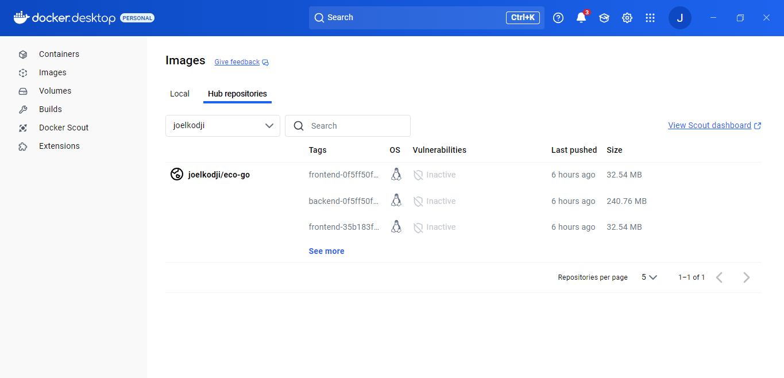
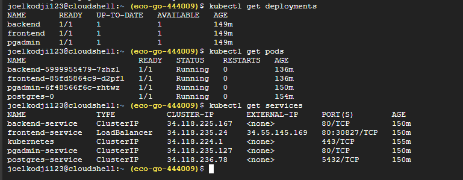
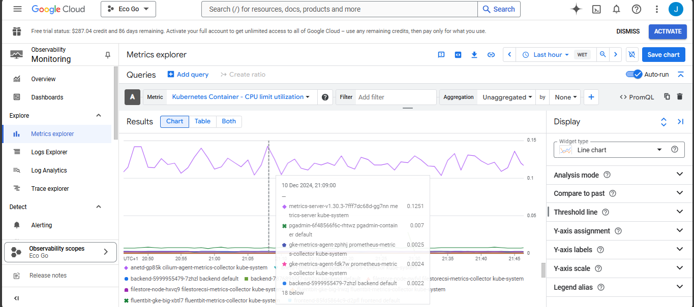

# Remote Soil Moisture Monitoring System  

## Overview  
The Remote Soil Moisture Monitoring System is a smart solution designed to help farmers optimize irrigation using real-time weather data, soil conditions, and predictive analytics. By leveraging remote data sources and modern technology, the system eliminates the need for physical sensors, making it cost-effective and scalable.  

## Features  
- **Weather & Soil Data Analysis:** Collects data from APIs (e.g., OpenWeatherMap, Open Meteo AI) to estimate soil moisture based on your current location.  
- **Irrigation Recommendations:** Generates optimized schedules based on soil moisture predictions, land size, soil type and crop type.  
- **Interactive Dashboards:** Visualizes soil trends, weather data uch as humidity and temperature, and irrigation plans.  
- **Sustainability:** Promotes water conservation and climate resilience.  

## Technologies  
- **Frontend:** HTML, CSS, Javascript, Nginx, PHP for user interface and dashboard.  
- **Database:** PostgreSQL for structured data storage and query optimization.  
- **Backend:** PHP for data processing and integration.  
- **Monitoring:**  Datadog & Managed Service with Prometheus.  
- **Containerization & Orchestration:** Kubernetes from Google Kubenertes Engine for scaling, deployment, and high availability.  
- **Testing:** PHPUnit for PHP scripts.  
- **Continuous Integration/Delivery:** GitHub Actions for automated pipelines.
- **Nginx** to render frontend pages fast
- **Docker hub/ Docker desktop** for containers and docker image creation

## Continuous Development
- Images of our trello board, find attached a link to the trello page: https://trello.com/b/tGpWEe0J/sustainable-urban-mobility-progress
- Aside Trello we used feature branches
- We used visual studio code for continuous development


  


## System Architecture


## Continuous Integration (CI) Pipeline

Our project implements a robust CI pipeline using GitHub Actions to ensure code quality and reliability. The pipeline automatically runs whenever code changes are pushed to the main branch or pull requests are created.

### CI Pipeline Features

- **Automated Testing**: Runs PHPUnit tests to verify code functionality
- **Code Quality Checks**: 
  - PHP Code Sniffer (PSR-12 standard)
  - PHP-CS-Fixer for automatic code style fixes
  - Basic PHP syntax validation
- **Dependency Management**: Automated Composer package installation and updates
- **Environment Setup**: Configures PHP 8.3 with required extensions

### CI Pipeline Status


### Pipeline Configuration

Our CI pipeline is configured in `.github/workflows/ci.yml` and includes:

1. Code checkout
2. PHP environment setup
3. Dependency installation
4. Code quality analysis
5. Automated testing
6. Build verification

For detailed configuration, see our [CI workflow file](.github/workflows/ci.yml).


## Continuous Testing

We used PHPUnit for unit testing. Syntax checking is done by PHP Code Sniffer. 


## Continuous Deployment (CD) Pipeline

Our project utilizes a robust deployment architecture combining Google Kubernetes Engine (GKE), Docker, and Kustomize for configuration management.

### Infrastructure Setup

1. **Google Kubernetes Engine (GKE)**
   - Created a new GKE cluster in Google Cloud Platform
   - Configured cluster in us-central1 zone for optimal performance
   - Set up IAM roles and permissions for team collaboration
   
   

2. **Container Registry Setup**
   - Established Docker Hub repository for container images
   - Created service accounts and authentication tokens
   - Configured secure access between GitHub Actions and cloud services

   
   
   

### Container Architecture

Our application runs on four main containers:

1. **Frontend Container**
   - Nginx-based web server
   - Serves static content and handles routing
   - Resources: 128Mi-256Mi memory, 100m-200m CPU

2. **Backend Container**
   - PHP 8.3 with Apache
   - Handles API requests and business logic
   - Resources: 128Mi-512Mi memory, 100m-200m CPU

3. **PostgreSQL Container**
   - Database server (PostgreSQL 15)
   - Persistent storage with 10Gi volume
   - Resources: 1Gi-2Gi memory, 500m-1000m CPU

4. **PgAdmin Container**
   - Database management interface
   - Resources: 128Mi-256Mi memory, 100m-200m CPU

### Configuration Management with Kustomize

Kustomize serves as our configuration management tool, providing:

- Resource customization without template modification
- Consistent deployment across environments
- Label and selector management

Our Kustomize structure:

```yaml
kubernetes/
├── base/                 # Base configurations
│   ├── backend.yaml
│   ├── frontend.yaml
│   ├── postgres-statefulset.yaml
│   └── pgadmin-deployment.yaml
└── overlays/            # Environment-specific configs
    ├── development/
    └── production/
```




### Deployment Process

Our deployment process is fully automated through GitHub Actions:

1. Code changes trigger the CI/CD pipeline
2. Docker images are built and pushed to Docker Hub
3. Kustomize updates the deployment configurations
4. GKE cluster receives the updated configurations
5. Kubernetes handles the rolling deployment


For detailed configuration, see our [CI/CD workflow file](.github/workflows/ci-cd.yml).

## Continuous Monitoring

We leverage Datadog's integration with Google Cloud Platform (GCP) to monitor our application's performance, security, and overall health in real-time. This setup provides comprehensive visibility into our Kubernetes-based infrastructure and application metrics.

### Infrastructure Monitoring

1. **Kubernetes Cluster Monitoring**
   - Pod health and status
   - Node performance
   - Container resource utilization
   - Deployment status


*Caption: Kubernetes cluster overview showing pod status, resource utilization, and node health across our GKE cluster*

2. **Application Performance**
   - API endpoint response times
   - Database query performance
   - Error rates and types
   - Resource consumption


*Caption: Application Performance Monitoring dashboard showing API latency, error rates, and database performance metrics*


### Real-time Metrics

Our monitoring setup tracks critical metrics including:
- System uptime and availability 
- Resource utilization trends
- Error frequency and patterns
- API performance metrics
- User experience data


*Caption: Datadog GCP integration page showing successful connection and data flow from our Google Cloud resources*

In addition to Datadog, we also use Google Cloud's Managed Service for Prometheus (GMP) to monitor our application's performance and health.


### Key Metrics Monitored

- Container resource utilization


- API endpoint performance


- Database connection health


- Error rates and response times


Alerting is also enabled for critical metrics, ensuring timely notifications for system anomalies.


## Continuous Feedback
We used Datadog's Real User Monitoring (RUM) to gather and analyze real-time user interactions, performance metrics, and behavior patterns. This implementation enables us to make data-driven decisions for improving user experience and application performance.

### Real User Monitoring Implementation

Our RUM setup tracks:

1. **User Journey Analytics**
   - Page navigation patterns
   - Feature usage frequency
   - Time spent on features
   

*Caption: User journey visualization showing common navigation paths and interaction patterns across the application*

2. **Performance Metrics**
   - Page load times
   - API response latency
   - Resource loading speed
   - Frontend rendering time


3. **Errors**
   - JavaScript errors
   - Failed API calls
   - UI rendering issues
   - Network failures


## Images of Deployed website find attached a link to website: https://34.55.145.169/
## Dashboard

*Dashboard showing realtime weather forecast(temperature, humdity and wind speed) based on your location, there is also a chart to visualize soil trends over a number of days and a card showing soil level every 3 hours*


*Recent activity based on irrigation schedule updates and upcoing tasks*

## Irrigation Scheduling Page


*Irrigation schedule page where the user can plan how they will shcedule the watering of their farms adn how much water will be used, it also makes use of their location*


## Irrigation Recommendation page


*Irrigation recommendation page which recommends irrigation metrics( irrigation window, amount of water needed for irrigation and actions to be taken) based on current weather conditions, soil moisture, humidity and wind speed. It also considers the plant type.*


## Profile page 

*Profile page to update user details*
